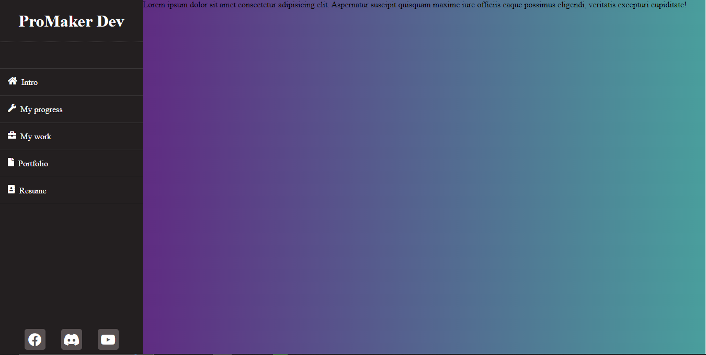

# Fixed Sidebar

## Overview

## Usage
To use the fixed sidebar, simply include the code snippet in your HTML file and it will be ready to use. You can customize the sidebar according to your design preferences and requirements.
## License
This repository is released under the MIT License. Feel free to use and modify the code as you see fit.
## Author
Developed by Eli John Mwoho