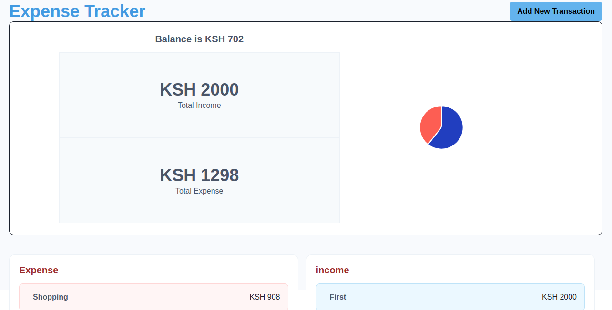

# Expense Tracker

An expense tracker application built with React and various other libraries to help you keep track of your income and expenses. The application provides a clear view of your financial balance, total income, and total expenses, with a breakdown of individual transactions.



## Features

- Track income and expenses
- Display balance, total income, and total expenses
- Visual representation of data using charts
- Responsive design using Chakra UI

## Getting Started

These instructions will help you set up the project on your local machine.

### Prerequisites

- Node.js (v14 or later)
- npm or yarn

### Installation

1. Clone the repository
    ```bash
    git clone https://github.com/ManNjoro/cool_projects.git
    cd React/expense-tracker
    ```

2. Install dependencies
    ```bash
    npm install
    # or
    yarn install
    ```

### Running the Application

To start the development server, run:
```bash
npm run dev
# or
yarn dev
```

## Technologies Used
- **React** - A JavaScript library for building user interfaces
- **Chakra UI** - A simple, modular and accessible component library

- **React ApexCharts** - A library for rendering charts
- **Vite** - A build tool that aims to provide a faster and leaner development experience for modern web projects